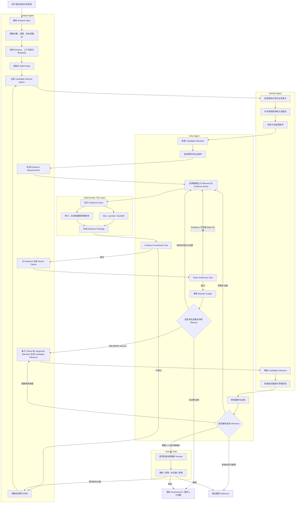

# 数据分析 Agent 论证架构与 MVP 迭代指南

> 本文记录当前项目对“数据分析 Agent”核心架构的共识，并作为后续 MVP 迭代的设计约束。
>
> 当前产品运行时与 Codex 集成的说明见 [`docs/architecture.zh-CN.md`](architecture.zh-CN.md)。本文关注的是更上层的分析推理架构：如何从一个具体分析需求，形成可追溯、可审阅的分析结论。

## 1. 设计结论

本项目不把数据分析 Agent 定义成“不断调用工具直到模型说完成”的通用自主 Agent，也不试图为所有分析类型写一套统一的 `done` 规则。

核心设计是：

```text
分析需求
  -> 候选解释模型（Candidate Warrant Space）
  -> 区分候选模型的 Evidence Action
  -> 可追溯 Evidence
  -> Atomic Claims
  -> Warrant 更新
  -> Inference
  -> 独立审阅 / 人工维护
```

优秀分析的核心不是“拿到一个数”，也不只是“数值计算正确”，而是：

> **构造一条可追溯的 Evidence -> Claim -> Inference 论证链，并明确每条推理依赖的 Warrant、假设和不确定性。**

简单取数可以在 Claim 层结束；只有需要解释、归因、预测或决策建议时，才继续形成 Inference。

## 2. 核心概念

### 2.1 Analysis Spec

分析任务的显式契约，至少包含：

- 用户问题和分析对象
- 数据范围、时间范围和目标人群
- 期望的交付物
- 当前已知的业务上下文
- 需要回答的开放问题
- 是否需要解释、预测、归因或决策建议

它不负责预先写死最终答案，而是定义分析要解决的问题边界。

### 2.2 Belief

当前对分析对象的假设、判断或不确定认识。

示例：

```text
渠道结构可能影响整体通过率。
```

Belief 是分析上下文，不是所有任务的必需输出。简单取数可以没有 Belief，也不需要强行产生 belief update。

### 2.3 Evidence

由数据、计算和方法产生的可审计观察结果。Evidence 不是一句自然语言，而是一个带有来源和推导过程的对象：

```text
Evidence
  ├── source / dataset / version
  ├── scope / filters / population
  ├── derivation / SQL / code
  ├── methodology
  ├── observed result
  ├── assumptions
  └── limitations
```

Evidence 的目标是让其他人能够回答：

```text
这个结果从哪里来？
使用了哪些数据和范围？
使用了什么计算或方法？
能否复现？
```

### 2.4 Claim

对 Evidence 做出的、范围明确的原子陈述。

示例：

```text
2025 年 6 月整体放款通过率比 5 月下降 4.2 个百分点。
```

Claim 主要回答：

```text
Evidence 允许我们准确地说什么？
```

### 2.5 Warrant

Warrant 是把 Claim 连接到 Inference 的推理规则、模型或适用前提。

示例：

```text
如果整体通过率是各渠道通过率按申请量加权得到的，
且低通过率渠道的权重上升、渠道口径保持稳定，
那么该结构变化会对整体通过率产生向下影响。
```

Warrant 不是 Agent 为目标结论补写的一句理由，而是一个需要：

- 有来源或独立依据
- 有适用条件
- 能产生可观测预测
- 有反证条件
- 可以随 Evidence 变化而修订

的候选关系模型。

### 2.6 Inference

基于：

```text
Prior Belief + Claims + Supported Warrant + Assumptions
```

形成的解释性判断、预测或决策建议。

Inference 必须带有适当强度和限制，例如：

```text
observed
supported
likely
plausible
associational
causal
```

不能把“可能的关联因素”直接表达为“确定的因果原因”。

### 2.7 Warrant Ledger

Warrant 不是静态注册表中的固定规则，而是一个可版本化、可维护的对象。

```text
candidate
  -> supported
  -> weakened
  -> specialized
  -> split
  -> rejected
```

每次更新都应记录：

- Warrant 版本
- 变化类型
- 支持或削弱它的 Evidence
- 新增或移除的假设
- 当前适用范围
- 当前验证状态

## 3. 不同任务的两条路径

### 3.1 事实性取数路径

对于“查一个数”“计算一个指标”“输出一张分组表”等任务，不需要强行生成 Warrant 或 Inference：

```text
Analysis Spec
  -> Evidence Plan
  -> 确定性执行
  -> Evidence Soundness
  -> Claim Sufficiency
  -> 输出 Claim
```

例如：

```text
Evidence：2025 年 6 月销售额合计为 1.25 亿元。
Claim：2025 年 6 月销售额为 1.25 亿元。
```

### 3.2 解释性分析路径

对于“为什么”“可能原因”“是否有效”“是否建议采用”等任务，进入 Warrant Loop：

```text
Analysis Spec
  -> 初始 Belief / 开放问题
  -> Candidate Warrant Space
  -> Evidence Actions
  -> Evidence
  -> Claims
  -> Warrant 更新
  -> Inference
  -> Critic / Domain / Human 审阅
```
## 4. Agent 角色设计

推荐保留三个逻辑 Agent，加一个按风险启用的人类 Gate。

### 4.1 Analyst Agent

Analyst 是主分析推进者，负责：

- 解析 Analysis Spec
- 初始化 Belief State
- 生成 Candidate Warrant Space
- 为候选 Warrant 提出预测、反证条件和 Evidence Requirements
- 形成 Atomic Claims
- 生成 Candidate Inference
- 根据 Critic 和 Domain 反馈修订分析

Analyst 不负责单方面宣布 Warrant 已经成立、Inference 已经被证明或分析可以结束。

### 4.2 Domain Agent

Domain Agent 是可插拔的业务和方法约束层，不需要每个任务都启用。

**分析前：**

- 检查指标口径
- 补充业务机制和领域假设
- 判断方法是否适用
- 指出不允许的推理方式

**Inference 形成后：**

- 检查结论是否符合业务语义
- 检查因果、关联、预测表述是否越界
- 提供领域替代解释
- 要求降低结论强度或增加限制

Domain Agent 不负责替代 Analyst，也不负责独立执行全部数据分析。

### 4.3 Critic Agent

Critic 是过程中的证据链和 Warrant 审计者，同时承担原先独立 Reviewer 的主要职责：

- 挑战 Candidate Warrant
- 检查 Warrant 是否只是目标结论的重述
- 生成可观测预测和反证条件
- 选择最能区分候选 Warrant 的 Evidence Action
- 检查 Evidence Soundness
- 检查 Evidence -> Claim 是否充分
- 更新 Warrant Ledger
- 检查 Claim + Warrant -> Inference
- 发现过度推断、循环论证和缺失假设
- 决定继续、修订、转人工或接受

Critic 参与过程，而不是只在最后打分。

### 4.4 Human Gate

人不需要参与每一轮普通分析，但应在以下情况介入：

- 高风险因果或经营结论
- 新 Warrant 需要长期沉淀
- Warrant Space 无法收敛
- 多个解释均无法被当前数据区分
- 需要对外发布、执行策略或发布模型

Human 的职责是最终业务责任和长期知识维护，不是替代所有自动化验证。

## 5. 从需求到 Inference 的完整流程



## 6. Warrant 的自主生产和维护

### 6.1 不从目标结论反向编 Warrant

不允许采用这种流程：

```text
Claim + Target Inference
  -> Agent 反向生成一个能解释结论的 Warrant
```

这会导致事后合理化。

如果用户已经提出一个结论，它应当被标记为：

```text
Hypothesis / Candidate Inference
```

而不是直接作为最终 Inference。

### 6.2 先生成 Candidate Warrant Space

Agent 不选择一个唯一 Warrant，而是生成多个候选关系：

```text
W1：渠道结构变化
W2：渠道内部表现变化
W3：用户结构变化
W4：数据质量或指标口径变化
```

每个候选 Warrant 必须包含：

- statement
- assumptions
- predictions
- disconfirming conditions
- required evidence
- current status

### 6.3 选择区分性 Evidence Action

Agent 的下一步不是“继续做一个看起来有用的分析”，而是选择最能区分候选 Warrant 的分析动作：

```text
W1 / W2 / W3 / W4
  -> 生成各自预测
  -> 找到最能区分它们的 Evidence Action
  -> 执行
  -> 更新 Warrant 状态
```

### 6.4 发现与验证分离

探索阶段允许 Agent 根据已有 Evidence 提出新的 Candidate Warrant，但该 Warrant 不能直接用同一批 Evidence 证明自己。

```text
Discovery Evidence
  -> Candidate Warrant
  -> Predictions
  -> Validation Evidence
  -> Warrant 状态更新
```

当无法使用新的数据时，至少需要明确标记：

```text
post_hoc
hypothesized
unverified
```

并限制最终 Inference 的强度。

### 6.5 Warrant Ledger 不是人工静态注册表

系统不需要人工提前登记所有业务 Warrant。人工主要提供基础能力和高风险维护：

- 指标定义
- 基础分析操作
- 方法约束
- 业务领域上下文
- 高风险知识审核

具体任务中的 Warrant 由 Agent 自主组合和维护，验证后可以选择沉淀到长期知识库。

### 6.6 Warrant 生产协议

Warrant 的生产不是“从结论反向补一个听起来合理的理由”，而是把当前任务中的**待验证推理关系**显式建模。它的输入至少包括：

```text
Analysis Spec
+ Prior Belief
+ Schema / Metric Semantics
+ Domain Context
+ 已知方法约束
```

生产过程分为五步。

#### Step 1：界定推理缺口

Analyst 先识别当前已知内容与目标分析输出之间缺少哪一种推理关系，而不是直接生成最终结论。

```text
已知：某指标下降
目标：解释下降来自哪里，以及可以采取什么行动
推理缺口：指标变化如何由结构、组内表现、样本选择或口径变化产生
```

这里产出的是 `reasoning_gap`，不是 Warrant 本身。它用于限定候选 Warrant 的问题域。

#### Step 2：生成 Candidate Warrant Space

Analyst 基于 `reasoning_gap`、Schema 和 Domain Context 生成多个竞争或互补的 Candidate Warrant。Domain Agent 负责补充领域机制、排除语义上不成立的候选；Critic 负责检查候选是否只是 Claim 或目标 Inference 的同义改写。

每个 Candidate Warrant 至少使用以下结构：

```yaml
warrant_id: W-001
statement: 渠道占比变化可以导致总体转化率变化
scope:
  population: 当前分析人群
  metrics: [overall_conversion, channel_conversion]
  time_range: 当前分析周期
assumptions:
  - 渠道定义在比较周期内一致
  - 各渠道转化率可比
predictions:
  - 渠道占比发生显著变化
  - 固定渠道转化率后，总体转化率仍会随渠道结构变化
disconfirming_conditions:
  - 渠道占比稳定
  - 标准化渠道结构后变化幅度不下降
required_evidence:
  - 分周期渠道占比
  - 分周期渠道内转化率
  - 结构标准化或分解结果
provenance:
  source: task_generated
  generated_by: analyst_agent
  based_on: [analysis_spec, schema_profile, domain_context]
status: proposed
```

`statement` 表达可复用的推理关系；`scope` 和 `assumptions` 限定它在哪些条件下成立；`predictions` 与 `disconfirming_conditions` 让它可被观察结果支持或削弱；`required_evidence` 则连接推理层和工具执行层。

#### Step 3：编译为 Evidence Requirements

Warrant 不能直接交给 SQL、Python 或其他工具执行。Analyst 需要把它编译成明确、可执行、可审计的 Evidence Requirements：

```text
Warrant
  -> 需要观察什么变量
  -> 需要什么比较或识别设计
  -> 需要控制哪些口径和混杂因素
  -> 哪种结果支持 / 削弱 / 无法区分该 Warrant
  -> 对应的 SQL / pandas / DuckDB / statistical action
```

Evidence Requirement 至少包含：

- 数据对象、字段、指标定义和粒度
- 样本范围、时间范围和对照范围
- 所需变换、分解、检验或模型
- 数据质量与方法前提
- 预期结果模式和判定规则
- 可支持或区分的 Warrant ID

这一步的关键产物不是“分析计划看起来完整”，而是建立可追踪映射：

```text
Evidence Action -> Evidence -> Candidate Warrant
```

#### Step 4：选择最有区分度的 Evidence Action

Critic 不以“信息量最多”作为唯一目标，而是优先选择能最大程度改变 Candidate Warrant Space 的动作。可以使用以下启发式：

```text
priority(action)
  = expected_discrimination
  * decision_relevance
  * evidence_reliability
  / execution_cost
```

一个好的 Evidence Action 应尽量满足：

- 不同候选 Warrant 对结果有不同预测
- 结果可以明确支持、削弱或排除至少一个候选
- 计算和方法可以被确定性工具复现
- 成本与当前结论风险相匹配

如果多个 Warrant 对现有数据给出相同预测，系统应输出“当前证据无法区分”，而不是任意选择一个解释。

#### Step 5：形成 Claims，再更新 Warrant

工具结果首先被表达为 Atomic Claims，再用于更新 Warrant。不能把原始表格或模型输出直接视为 Warrant 已成立。

```text
Tool Result
  -> Evidence
  -> Atomic Claim
  -> Warrant Update
  -> Inference
```

例如：

```text
Evidence：渠道 A 占比从 20% 上升到 40%，渠道内转化率基本稳定
Claim：观察期内渠道结构发生变化，且组内表现变化较小
Warrant Update：支持“结构变化影响总体指标”，削弱“渠道内表现恶化”
Inference：总体转化率变化主要与渠道结构变化一致
```

这里的 Inference 强度仍受识别设计限制。“与……一致”“主要由……解释”和“由……导致”必须对应不同强度的 Warrant 与 Evidence。

### 6.7 Warrant 维护协议

Warrant Ledger 保存的不是一组不可变规则，而是 Candidate Warrant 在任务中的状态、证据引用、适用范围和版本历史。

#### 6.7.1 Ledger 操作

最小实现应支持以下操作：

| 操作 | 含义 | 典型触发条件 |
| --- | --- | --- |
| `propose` | 创建新的候选 Warrant | 出现新的推理缺口或解释候选 |
| `instantiate` | 将通用 Warrant 绑定到当前指标、人群和时间范围 | 从长期知识库检索到可复用模板 |
| `support` | 增加支持证据并提高置信状态 | 预测被独立 Evidence 命中 |
| `weaken` | 降低支持程度，但暂不排除 | 预测仅部分成立或出现相反 Evidence |
| `specialize` | 收窄适用范围或补充假设 | 只在特定人群、周期或口径下成立 |
| `split` | 将过宽 Warrant 拆成多个可区分子 Warrant | 不同机制被同一个 statement 混合表达 |
| `reject` | 在当前任务中排除 | 关键预测被反证或前提不成立 |
| `promote` | 晋升为可跨任务复用的 Warrant | 多任务验证、领域审阅和来源完整 |

状态更新不能只保存一个最终标签。每次操作都应生成新版本并保留：

```yaml
version: 3
operation: specialize
previous_version: 2
evidence_refs: [E-007, E-009]
claim_refs: [C-004]
changed_fields: [scope.population, assumptions]
rationale: 该关系仅在新客样本中得到支持
actor: critic_agent
reviewers: [domain_agent]
created_at: 2026-07-17T00:00:00Z
```

因此，Warrant 的“置信”不是脱离语境的单一概率，而是以下信息的组合：

- 当前状态：`proposed / supported / weakened / rejected / inconclusive`
- 支持与反对 Evidence 的数量、质量和独立性
- 仍然成立的 assumptions
- 已验证的 scope
- 发现证据与验证证据是否分离
- Domain / Critic / Human 的审阅记录

#### 6.7.2 Task-local 与 Promoted Warrant

系统应明确区分两层 Warrant：

**Task-local Warrant**

- 由当前任务自主生成或实例化
- 默认只在当前 Analysis Spec、数据范围和假设下有效
- 可以快速 `propose / weaken / split / reject`
- 不自动污染长期知识库

**Promoted Warrant**

- 来自多个任务中重复出现且被独立验证的关系
- 具有稳定的领域定义、适用范围、反例和版本记录
- 经过 Domain Agent、Critic 或 Human 的晋升审阅
- 作为下一任务的候选模板，而不是不可质疑的事实

推荐的晋升门槛是：

```text
多任务复现
+ 独立 Validation Evidence
+ 明确 Scope 与 Assumptions
+ 已知反例 / Disconfirming Conditions
+ 完整 Provenance
+ Domain / Human Review（高风险场景必需）
```

Promoted Warrant 被新任务使用时，必须先执行 `instantiate`，重新绑定当前语境并验证 assumptions，不能直接继承历史支持状态。

#### 6.7.3 各 Agent 的维护职责

| 角色 | Warrant 相关职责 |
| --- | --- |
| Analyst Agent | 识别 reasoning gap、生成候选、编译 Evidence Requirements、形成 Claim 和初步 Inference |
| Domain Agent | 提供领域机制和边界、校验指标语义与 assumptions、审查 specialize / promote |
| Critic Agent | 去除循环论证、选择区分性动作、审计 Evidence、执行 Ledger 状态变更 |
| Human | 审核高风险 Inference、处理无法形式化的价值判断、维护长期 Promoted Warrant |

同一个模型可以在 MVP 中依次扮演 Analyst 和 Critic，但必须使用分离的上下文、结构化产物和审计步骤，避免同一次生成同时提出 Warrant 又宣布其成立。

### 6.8 Warrant 驱动的 Agent Loop 与 Done

Warrant 驱动的分析循环可以表达为：

```text
维护 Candidate Warrant Space
  -> 选择最有区分度的 Evidence Action
  -> 执行工具获取 Evidence
  -> 形成 Atomic Claims
  -> 更新 Warrant Ledger
  -> 对仍被支持的 Warrant 形成 Inference
  -> 判断继续、停止或转人工
```

这里的 `done` 不是“LLM 认为答案已经不错”，而是显式终止协议。满足以下任一条件即可停止：

1. **Supported**：至少一个 Warrant 达到任务要求的支持强度，Inference 通过 Evidence Soundness、Claim Sufficiency、Inference Warrant 和 Traceability 测试。
2. **Resolved by scope**：任务只是简单取数，Evidence 已足以形成 Claim，不需要进入 Warrant / Inference 层。
3. **Inconclusive**：剩余 Warrant 在当前可用数据下不可区分，系统明确输出缺少什么 Evidence。
4. **Rejected**：所有候选 Warrant 均被削弱或排除，需要重新定义 Analysis Spec 或生成新的候选空间。
5. **Escalated**：涉及高风险因果、价值判断、业务语义冲突或超出授权范围，转交 Domain Agent 或 Human。
6. **Budget exhausted**：达到时间、成本或迭代上限，输出当前 Ledger、未解决分歧和下一步建议，而不是强行给出确定结论。

因此，这个 Agent Loop 的优化目标不是无限寻找更多分析，而是：

> 持续缩小可行的 Warrant Space，直到 Inference 获得足够支持，或系统能够准确说明为什么当前无法形成可靠 Inference。

### 6.9 明确禁止的生产方式

以下路径必须被 Critic 拒绝：

```text
Target Inference
  -> 生成支持它的 Claim
  -> 反向编造 Warrant
  -> 只寻找确认性 Evidence
```

典型反例：

```text
Claim：太阳今天从东边升起
Target Inference：太阳明天也会从东边升起
伪 Warrant：总能根据今天的观察预测明天
```

问题不在于 statement 的语言是否通顺，而在于它没有说明可迁移机制、适用范围、稳定性假设和反证条件。合格的 Warrant 必须能在目标 Inference 之外被独立描述，并产生可被观察挑战的预测。

## 7. 最小可复用测试内核

不按“趋势分析、因果分析、实验分析、建模分析”等任务类型拆出大量测试体系，而是保留以下通用内核。

### Test A：Evidence Soundness

```text
Evidence 的来源、范围、计算和方法是否 sound、correct、可复现？
```

### Test B：Claim Sufficiency

```text
Evidence 是否足以支持 Claim？
Claim 是否超出了 Evidence 的范围、粒度和语义？
```

### Test C：Inference Warrant

```text
Prior Belief + Claim + Warrant + Assumptions
是否足以支持 Inference？
Inference 是否超出了 Warrant 的强度？
```

### Test D：Traceability

```text
每个 Claim 是否引用 Evidence？
每个 Inference 是否引用 Belief、Claim、Warrant 和 Assumptions？
```

测试结果不应只有 `pass/fail`，建议使用：

```text
supported
partially_supported
unsupported
inconclusive
```

## 8. 当前项目映射

当前实现已经具备一部分基础，但还没有完整落地上述论证图。

### 8.1 已有能力

| 目标能力 | 当前实现 |
|---|---|
| 文件与 Schema 输入 | `backend/profiler/schema_profiler.py` |
| 结构化分析计划 | `backend/schemas/plan.py:157` |
| Skill-native Plan 兼容 | `backend/planning/adapters.py:189` |
| 计划完整性 Review | `backend/routers/tasks.py:217` |
| 计划修改 | `backend/routers/tasks.py:689` |
| 执行前 Gate | `backend/planning/run_guard.py:10` |
| 确定性数据执行 | `backend/execution/engine.py:13` |
| 任务状态和 Review | `backend/schemas/task.py:17` |
| 运行快照和事件 | `backend/observability.py:22` |
| Codex Provider | `backend/codex/factory.py:21` |

### 8.2 当前缺口

当前 `AnalysisPlan` 和 `ResultPayload` 主要表达：

```text
怎么执行
执行出了什么结果
```

还没有正式表达：

```text
Evidence 对象
Atomic Claim
Candidate Warrant
Warrant Ledger
Inference
Claim / Warrant / Inference 的审计结果
```

此外，当前的 `completeness` 主要表示：

```text
Plan 是否准备好执行
```

而不是：

```text
结果是否足以支持最终 Inference
```

因此后续不要继续把所有推理字段都塞入 `AnalysisPlan`，建议在执行结果外增加独立的分析论证对象。

## 9. 建议的目标对象

后续可以新增以下内部对象，不要求第一阶段立即暴露为公开 API。

```text
AnalysisArgumentGraph
  ├── analysis_spec
  ├── belief_state
  ├── evidence_items
  ├── claims
  ├── warrant_versions
  ├── inferences
  ├── assumptions
  ├── alternatives
  └── review_verdict
```

推荐的内部模型：

```text
EvidenceItem
  - evidence_id
  - source_refs
  - scope
  - derivation
  - methodology
  - observed_result
  - assumptions
  - limitations

Claim
  - claim_id
  - statement
  - evidence_refs
  - scope
  - claim_strength

WarrantVersion
  - warrant_id
  - version
  - statement
  - scope
  - assumptions
  - predictions
  - disconfirming_conditions
  - required_evidence
  - supporting_evidence_refs
  - opposing_evidence_refs
  - provenance
  - status

Inference
  - inference_id
  - statement
  - prior_belief_refs
  - claim_refs
  - warrant_refs
  - limitations
  - strength
```

## 10. MVP 迭代建议

### P0：保留当前主链，增加论证产物

目标：不改变现有用户流程和执行能力。

建议：

1. 保留当前 `AnalysisPlan -> run_plan -> ResultPayload` 主链。
2. 在执行后生成结构化 `EvidenceItem`，不要只保存表格和自然语言摘要。
3. 将摘要中的事实性句子拆成 Atomic Claims。
4. 为每个 Claim 保存 Evidence 引用。
5. 暂时只实现 Evidence Soundness 和 Claim Sufficiency。

### P1：增加 Critic Loop

目标：让系统能够发现证据不足和结论过强。

建议：

1. 增加 Candidate Warrant 输出格式。
2. 为 Warrant 强制生成 predictions 和 falsifiers。
3. 增加 Critic Agent 节点。
4. 当 Claim 不被支持时，允许收窄 Claim 或补充 Evidence。
5. 记录 `supported / partially_supported / unsupported / inconclusive`。

### P2：增加 Warrant Ledger 和 Domain Agent

目标：让复杂分析能够维护多个候选解释。

建议：

1. 用版本化 Ledger 保存 Warrant。
2. 支持 propose、instantiate、support、weaken、specialize、split、reject、promote。
3. 将 Warrant 编译为可执行的 Evidence Requirements，并保存完整映射。
4. 对因果、实验、评分卡等高风险任务启用 Domain Agent。
5. Domain Agent 负责领域语义和方法边界，不替代 Critic。
6. 将高价值、人工确认过的 Warrant 以 Promoted Warrant 形式沉淀到知识库。

### P3：迁移到 LangChain / LangGraph 或其他纯 API Runtime

目标：去除对 Codex Runtime 的依赖，同时保留业务架构。

建议映射：

```text
LegacyCodexProvider
  -> LLM API / LangChain ChatModel

AnalysisPlan / TaskRecord
  -> LangGraph State

pending_review
  -> interrupt / checkpoint / human resume

Warrant Proposer / Critic / Domain
  -> LangGraph nodes 或 subgraphs

execution.engine.py
  -> 保留为确定性工具节点

artifacts / events.log
  -> 保留为证据和审计存储
```

不要在 P0 阶段直接把整个项目改成一个自由调用工具的超级 Agent。
## 11. 设计原则

### 原则一：流程节点不等于 Agent

执行、解析、验证、保存、生成图表都可以是确定性节点，不应为了“Agent 化”而强行交给 LLM。

### 原则二：Warrant 不能是事后理由

Warrant 必须带有预测、反证条件和证据来源。不能只因为它能解释当前结果，就认为它成立。

### 原则三：Discovery 和 Justification 分离

Agent 可以探索和提出候选解释，但候选 Warrant 需要新的 Evidence 或独立方法验证。

### 原则四：结论强度不能超过 Warrant 强度

如果 Warrant 只支持关联性，Inference 就不能写成确定因果。

### 原则五：支持多个候选解释

在证据无法区分时，输出 `inconclusive` 或保留多个候选解释，不要强行选择一个故事。

### 原则六：所有重要结论都要可回溯

最终 Inference 必须能够回溯到：

```text
Prior Belief
  -> Claims
  -> Evidence
  -> Warrant
  -> Assumptions
```

### 原则七：高风险结论保留人工责任

自动化系统可以提高分析效率，但不应自动承担重大因果、经营和风控决策的最终责任。

## 12. 非目标

当前 MVP 不追求：

- 为所有分析类型预先设计完整测试树
- 让 Agent 自由执行任意 shell 或 Python
- 让 Agent 自动把所有 Warrant 写入长期知识库
- 用一个分数概括“分析质量”
- 证明现实世界中的绝对因果真理
- 为每个流程节点都创建独立 Agent

当前最重要的目标是：

```text
让分析过程产生结构化、可追溯、可审阅的 Evidence / Claim / Warrant / Inference 链。
```
