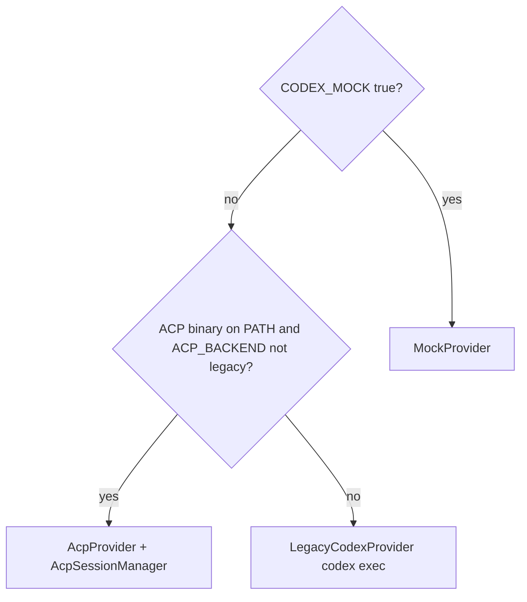

# Architecture & Developer Guide

> [简体中文](architecture.zh-CN.md)

This document explains how the system is structured, how **chat vs task** flows work, how the **LLM runtime** (mock / ACP / legacy Codex) is selected, and how to extend the codebase. Start here if you are contributing for the first time.

---

## System Overview

```
User (browser)
    │
    ▼
Streamlit  (app/streamlit_app.py)
    │  HTTP (requests) — tasks, chat, optional profile
    ▼
FastAPI  (backend/main.py)
    ├── Routers
    │   ├── /tasks      — structured analysis lifecycle + plan revision
    │   ├── /chat       — free-form assistant turns
    │   ├── /data/profile — schema profile without creating a task (chat context)
    │   └── /skills     — list SKILL.md metadata
    ├── Profiler        — upload → DataFrame + schema_profile dict
    ├── Provider layer  — get_provider() → Mock | ACP | Legacy Codex
    ├── Execution engine — AnalysisPlan → pandas → ResultPayload
    └── Observability   — artifacts/events.log + per-task JSON snapshots
```

The **AnalysisPlan** JSON remains the contract between the planner LLM and the execution engine. Chat mode does not require a plan; task mode centers on it.

**Provider selection** (see `backend/acp/factory.py`):



---

## Streamlit: Chat vs Task

| Concept | Behavior |
|---------|-----------|
| **Chat mode** | Default. Messages go to `POST /chat` with optional `file_context` from cached schema profile. |
| **Task mode** | User sends `/task <question>`. Creates `POST /tasks`, shows plan card; further messages can revise plan via `POST /tasks/{id}/revise` until confirmed. |
| **Schema cache** | `POST /data/profile` refreshes profile when file changes; used to populate chat context without a task id. |
| **Completion** | After results, UI can “mark complete” (back to chat) or “replan” (new task with combined feedback). |

Sidebar shows current **mode** and **active_task_id** for debugging.

---

## LLM & Agent Runtime (`backend/acp/`)

All non-mock LLM entry points go through **`get_provider()`**. The public surface is five async methods: `generate_plan`, `generate_summary`, `generate_followups`, `chat`, `revise_plan`.

| Module | Role |
|--------|------|
| `factory.py` | Chooses provider; owns singleton `AcpSessionManager`; `shutdown_providers()` on app lifespan exit. |
| `client.py` | `AnalysisAcpClient` (ACP callback impl) + `AcpSessionManager` (`initialize`, `session/new`, `session/prompt`, stream accumulation). Imports **`acp` lazily** so missing `agent-client-protocol` does not break mock-only startup. |
| `provider.py` | `AcpProvider` — builds prompts from `backend/codex/prompts.py`, calls `prompt_for(logical_key, text)`, parses JSON. |
| `legacy_codex.py` | `LegacyCodexProvider` — previous `codex exec` one-shot behavior. |
| `mock.py` | `MockProvider` — deterministic plans and canned chat. |
| `json_util.py` | Extract JSON object/array from noisy LLM text. |
| `errors.py` | `CodexAdapterError` (shared). |

**Shims:** `backend/codex/adapter.py` and `backend/codex/mock.py` re-export legacy/mock types for older imports (e.g. scripts).

### ACP sessions

- One **agent subprocess** per FastAPI process (shared singleton).
- **Logical keys** → ACP `session_id`: e.g. each `task_id` for plan/summary/followups/revise; a fixed env key (`ACP_CHAT_SESSION_KEY`) for `/chat` so follow-ups share context.
- **`session/new` `cwd`:** `ACP_SESSION_CWD` or repo root (see `factory._acp_session_cwd`). Codex discovers `.agents/skills` and `AGENTS.md` from this directory.

### Skills & prompts (`backend/skills/` + `.agents/skills/`)

- **SkillRegistry** scans `.agents/skills/*/SKILL.md`, parses frontmatter, lazy-loads bodies.
- **`build_*_prompt(..., skill_instructions=...)`** in `prompts.py` prepends an optional `## Skill Context` block.
- **Injection policy** (`acp_agent_uses_native_skills()`): if the ACP command looks like Codex (`codex` in `ACP_AGENT_COMMAND`) and `ACP_AGENT_NATIVE_SKILLS` is not forced off, skills are **not** duplicated into prompts. **Legacy** provider always injects (subprocess does not load repo skills).

---

## Request Lifecycles

### A — Structured task (`/tasks`)

1. **`POST /tasks`** — File + question → profiler → `generate_plan` → store `TaskRecord` (`planned`) + DataFrame in memory.
2. **Review** — UI loads plan; user may edit JSON.
3. **`POST /tasks/{id}/revise`** (optional) — User message while plan pending → `revise_plan` → updated `AnalysisPlan`.
4. **`POST /tasks/{id}/review`** — `final_plan` → `run_plan` → `generate_summary` + `generate_followups` → `completed` / `failed`.
5. **`GET /tasks/{id}/result`** — `ResultPayload`.

### B — Free-form chat (`POST /chat`)

JSON body: `message`, `history[]`, optional `file_context` (schema profile dict), optional `use_mock`. Returns `{ "reply": "..." }`. Does not mutate task storage.

### C — Profile only (`POST /data/profile`)

Upload file → same profiler as tasks → returns **schema_profile** JSON only (no `TaskRecord`).

---

## Key Data Structures

Canonical Pydantic models live in `backend/schemas/`.

### `AnalysisPlan` (`schemas/plan.py`)

Produced by the planner (and reviser), consumed by `execution.engine.run_plan`.

```
goal, metrics[], dimensions[], filters[], output{chart_type, show_table},
ambiguities[], confidence
```

### `TaskRecord` (`schemas/task.py`)

`status`: `created` → `planned` → `reviewing` → `running` → `completed` | `failed`

### `ResultPayload` (`schemas/result.py`)

`chart`, `table`, `execution_summary`, `summary`, `follow_ups[]`

---

## Prompts (`backend/codex/prompts.py`)

| Function | Used for |
|----------|-----------|
| `build_plan_prompt` | Initial plan JSON |
| `build_revise_plan_prompt` | Full plan rewrite from user instruction |
| `build_summary_prompt` | Chinese narrative after execution |
| `build_followups_prompt` | JSON array of 3 strings |
| `build_chat_prompt` | Plain-text conversational reply |

**Quality work:** tune rules in prompts **and** in `.agents/skills/*/SKILL.md` (keep them aligned). The JSON schema string in `build_plan_prompt` must stay consistent with `AnalysisPlan`.

---

## Execution Engine (`backend/execution/engine.py`)

`run_plan(df, plan) → ResultPayload` — pure pandas. See existing doc sections: `_apply_filters`, `_aggregate`, `_build_chart`. Extend `Aggregation` / `FilterOperator` / `ChartType` in `schemas/plan.py` when adding capabilities.

---

## Schema Profiler (`backend/profiler/schema_profiler.py`)

`profile_upload` — CSV / XLSX / XLS; samples large files; returns `(DataFrame, schema_profile dict)` used by tasks, chat context, and `/data/profile`.

---

## Observability & Storage

Unchanged MVP behavior: `artifacts/events.log`, `artifacts/tasks/<task_id>/*.json`, in-memory `TASKS` / `TASK_DATAFRAMES` / `TASK_SNAPSHOTS` in `backend/storage.py` (lost on restart).

---

## HTTP API Reference

| Method | Path | Purpose |
|--------|------|---------|
| `GET` | `/` | Service banner |
| `GET` | `/health` | Liveness |
| `GET` | `/skills` | List skill metadata (`name`, `description`, `path`) |
| `POST` | `/chat` | Free-form assistant message |
| `POST` | `/data/profile` | Upload file → schema profile only |
| `POST` | `/tasks` | Create task → plan |
| `GET` | `/tasks/{id}` | Full `TaskRecord` |
| `POST` | `/tasks/{id}/revise` | Revise pending plan from natural language |
| `POST` | `/tasks/{id}/review` | Submit `final_plan` → execute |
| `GET` | `/tasks/{id}/result` | `ResultPayload` or status |
| `POST` | `/tasks/{id}/fail` | Dev: force failed |
| `POST` | `/tasks/{id}/reset` | Reset to `planned` |

Swagger: `http://127.0.0.1:8000/docs`

---

## Step-by-Step Developer Walkthrough

### Prerequisites

Python **3.12+**, **`uv`**. Codex CLI **optional** if `CODEX_MOCK=true`.

```bash
uv sync
uv run python -c "import fastapi, streamlit; print('OK')"
```

### Layer 0 — Regression (no server)

```bash
uv run python tests/run_regression.py --mode mock
```

Expect all cases `ok` (exercises mock provider + engine + schemas).

### Layer 1 — Backend API

```bash
uv run uvicorn backend.main:app --reload
```

- `curl http://127.0.0.1:8000/health`
- `curl http://127.0.0.1:8000/skills` — should list registered skills when `.agents/skills` exists.
- Create task (same as before): `POST /tasks` with form file + question.
- Optional: `POST /chat` with JSON `{"message":"hello","history":[]}`.

### Layer 2 — Streamlit

```bash
uv run streamlit run app/streamlit_app.py
```

Upload a fixture CSV, send a chat line, then `/task …` and complete review → results.

### Debugging

| Check | Location |
|-------|-----------|
| Backend logs | uvicorn terminal |
| Events | `artifacts/events.log` |
| Per-task | `artifacts/tasks/<task_id>/` |
| Provider transport | Snapshots may include `"transport": "acp"` vs legacy |

### Common Issues

| Symptom | Cause | Fix |
|---------|-------|-----|
| `No module named 'acp'` | `agent-client-protocol` not installed | `uv sync` |
| `ImportError: ACP mode requires 'agent-client-protocol'` | Mock disabled, SDK missing | Install package or use mock |
| `ModuleNotFoundError: No module named 'backend'` | Wrong CWD | Run from repo root |
| Port 8000 in use | Stale uvicorn | Kill process or change port |
| Streamlit `ConnectionRefusedError` | Backend down | Start API first |
| Empty chart | Filters too strict | Relax plan filters |
| Codex ignores skills | Wrong ACP cwd | Set `ACP_SESSION_CWD` to repo root |

---

## Adding a Feature — Checklist

### New filter / chart / aggregation

1. Update `backend/schemas/plan.py` enums.
2. Update `backend/execution/engine.py` (`_apply_filters` / `_build_chart` / agg path).
3. Update `build_plan_prompt` + matching `.agents/skills/analysis-planner/SKILL.md` if used.
4. Add regression case in `tests/fixtures/`.

### New LLM surface

1. Add `build_*_prompt` in `prompts.py` (optional `skill_instructions`).
2. Add method on **MockProvider**, **AcpProvider**, and **LegacyCodexProvider** (keep parity).
3. Expose via router; wire Streamlit if user-facing.

### Improve plan quality

Edit prompts **and** skill markdown; add few-shot examples; tighten JSON shape description.

---

## Running Tests

```bash
uv run python tests/run_regression.py --mode mock
uv run python tests/run_regression.py --mode real   # requires Codex CLI
```

---

## MVP Boundaries (Updated)

| Feature | Status | Notes |
|---------|--------|-------|
| Persistent storage | Not implemented | In-memory tasks only |
| Authentication | Not implemented | — |
| Long-term user memory | Not implemented | ACP session = process-scoped context |
| **Skill library (repo)** | **Partial** | `.agents/skills` + registry + injection; no UI editor / artifact→skill loop |
| **ACP integration** | **Implemented** | Optional; requires agent binary + SDK |
| **Chat + task modes** | **Implemented** | Streamlit + `/chat` + `/tasks` + revise |
| Streaming to browser | Not implemented | ACP streams aggregated server-side only |
| Excel export | Not implemented | Table CSV only |
| Multi-file joins | Not implemented | One file per task |
| Column ACL | Not implemented | — |

---

## Dependency Notes

| Package | Purpose |
|---------|---------|
| `fastapi`, `uvicorn` | API |
| `streamlit` | UI |
| `pandas`, `numpy` | Execution |
| `pydantic` | Schemas |
| `python-multipart` | Uploads |
| `requests` | Streamlit → HTTP |
| **`agent-client-protocol`** | ACP client (`import acp`); lazy-loaded in `backend/acp/client.py` |

**Codex CLI** / **`codex-acp`** are not Python packages — install separately and ensure `PATH` (or override env vars). With `CODEX_MOCK=true`, neither is invoked.

---

## Legacy: Original “Codex adapter” narrative

The historical **CodexAdapter** one-shot subprocess implementation now lives in **`LegacyCodexProvider`** (`backend/acp/legacy_codex.py`). `backend/codex/adapter.py` is a **shim** for backward compatibility. New code should depend on **`get_provider()`** or types under `backend.acp`.
