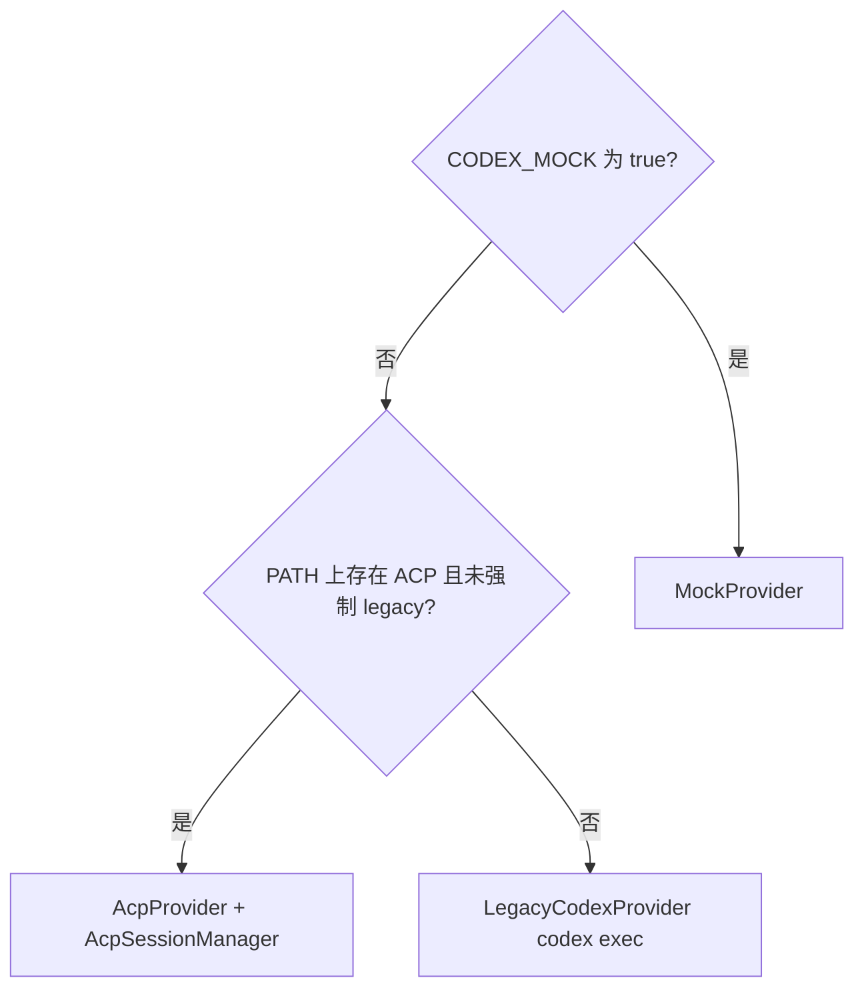

# 架构说明与开发者指南

> [English](architecture.md)

本文说明系统分层、**对话（Chat）与任务（Task）** 如何协作、**大模型运行时**（Mock / ACP / Legacy Codex）如何选型，以及如何扩展功能。首次参与本仓库建议从这里读起。

---

## 系统总览

```
用户（浏览器）
    │
    ▼
Streamlit  (app/streamlit_app.py)
    │  HTTP（requests）— tasks、chat、可选 profile
    ▼
FastAPI  (backend/main.py)
    ├── 路由
    │   ├── /tasks      — 结构化分析生命周期 + 改计划
    │   ├── /chat       — 自由对话
    │   ├── /data/profile — 仅生成 schema 画像（不建任务）
    │   └── /skills     — 列出 SKILL.md 元数据
    ├── Profiler        — 上传 → DataFrame + schema_profile
    ├── Provider 层     — get_provider() → Mock | ACP | Legacy
    ├── Execution       — AnalysisPlan → pandas → ResultPayload
    └── Observability   — artifacts/events.log + 每任务 JSON 快照
```

**AnalysisPlan** 仍是「规划 LLM」与「执行引擎」之间的契约。对话模式不强制产出计划；任务模式以计划为核心。

**Provider 选择**（`backend/acp/factory.py`）逻辑概要：



---

## Streamlit：对话 vs 任务

| 概念 | 行为 |
|------|------|
| **对话模式** | 默认。消息走 `POST /chat`，可带缓存的 `file_context`（schema profile）。 |
| **任务模式** | 用户发送 `/task <问题>`。创建 `POST /tasks`，展示计划卡片；在计划待确认前，普通消息可走 `POST /tasks/{id}/revise`。 |
| **Schema 缓存** | 文件变更时 `POST /data/profile` 刷新；聊天可不绑定 task_id 即带列信息。 |
| **结果之后** | 「标记完成」回到对话；「未完成 — 重新规划」合并备注开新任务。 |

侧边栏展示当前 **mode** 与 **active_task_id**，便于排查。

---

## 大模型与 Agent 运行时（`backend/acp/`）

所有非 Mock 的 LLM 入口经 **`get_provider()`** 统一出口。对外是五个异步方法：`generate_plan`、`generate_summary`、`generate_followups`、`chat`、`revise_plan`。

| 模块 | 职责 |
|------|------|
| `factory.py` | 选择 Provider；持有 `AcpSessionManager` 单例；应用 `lifespan` 结束时 `shutdown_providers()`。 |
| `client.py` | `AnalysisAcpClient`（ACP 回调）+ `AcpSessionManager`（`initialize`、`session/new`、`session/prompt`、流式文本拼接）。对 **`acp` 包延迟导入**，避免未装 `agent-client-protocol` 时 Mock 模式无法启动。 |
| `provider.py` | `AcpProvider`：用 `backend/codex/prompts.py` 组提示词，调 `prompt_for(逻辑键, 文本)`，再解析 JSON。 |
| `legacy_codex.py` | `LegacyCodexProvider`：原「每次 `codex exec`」行为。 |
| `mock.py` | `MockProvider`：确定性计划与固定对话。 |
| `json_util.py` | 从模型输出中抠 JSON 对象/数组。 |
| `errors.py` | `CodexAdapterError`。 |

**兼容层：** `backend/codex/adapter.py`、`mock.py` 仅为旧引用重导出；新代码应使用 `get_provider()` 或 `backend.acp` 下类型。

### ACP 会话

- 每个 FastAPI 进程通常 **一个 agent 子进程**（单例）。
- **逻辑键** 映射到 ACP `session_id`：如每个 `task_id` 用于计划/总结/追问/改计划；`/chat` 使用固定环境变量键 `ACP_CHAT_SESSION_KEY` 以保持多轮上下文。
- **`session/new` 的 `cwd`：** 由 `ACP_SESSION_CWD` 或仓库根决定（`factory._acp_session_cwd`）。Codex 由此发现 `.agents/skills` 与 `AGENTS.md`。

### 技能与提示词（`backend/skills/` + `.agents/skills/`）

- **SkillRegistry** 扫描 `.agents/skills/*/SKILL.md`，解析 frontmatter，正文懒加载。
- **`build_*_prompt(..., skill_instructions=...)`** 可在文首追加 `## Skill Context`。
- **注入策略**（`acp_agent_uses_native_skills()`）：若 `ACP_AGENT_COMMAND` 含 `codex` 且未强制关闭，则假定 Codex **自行发现**技能，不在提示词里重复灌入。**Legacy** 子进程不会读仓库技能，故 **始终注入**。

---

## 请求生命周期

### A — 结构化任务（`/tasks`）

1. **`POST /tasks`** — 文件 + 问题 → 画像 → `generate_plan` → 内存中 `planned` + DataFrame。
2. **审阅** — 展示/编辑计划 JSON。
3. **`POST /tasks/{id}/revise`**（可选）— 自然语言改计划 → `revise_plan`。
4. **`POST /tasks/{id}/review`** — 提交 `final_plan` → `run_plan` → `generate_summary` / `generate_followups` → `completed` 或 `failed`。
5. **`GET /tasks/{id}/result`** — 取 `ResultPayload`。

### B — 自由对话（`POST /chat`）

JSON：`message`、`history[]`、可选 `file_context`、可选 `use_mock`。返回 `{ "reply": "..." }`。不写任务存储。

### C — 仅画像（`POST /data/profile`）

上传文件 → 与任务相同的 profiler → 只返回 **schema_profile**，不创建 `TaskRecord`。

---

## 核心数据结构

契约定义在 `backend/schemas/`（Pydantic）。

### `AnalysisPlan`（`schemas/plan.py`）

由规划/改计划产出，由 `execution.engine.run_plan` 消费。

### `TaskRecord`（`schemas/task.py`）

状态：`created` → `planned` → `reviewing` → `running` → `completed` | `failed`

### `ResultPayload`（`schemas/result.py`）

`chart`、`table`、`execution_summary`、`summary`、`follow_ups`

---

## 提示词（`backend/codex/prompts.py`）

| 函数 | 用途 |
|------|------|
| `build_plan_prompt` | 初次生成计划 JSON |
| `build_revise_plan_prompt` | 按用户说明重写整份计划 |
| `build_summary_prompt` | 执行后的中文解读 |
| `build_followups_prompt` | 三条追问（JSON 数组） |
| `build_chat_prompt` | 对话纯文本回复 |

**调优：** 同时维护 `prompts.py` 与 `.agents/skills` 下对应 `SKILL.md`，避免两套规则漂移。`build_plan_prompt` 中的 JSON 形状描述须与 `AnalysisPlan` 一致。

---

## 执行引擎（`backend/execution/engine.py`）

`run_plan(df, plan) → ResultPayload`，纯 pandas。扩展方式：在 `schemas/plan.py` 增加枚举，在 `_apply_filters` / `_aggregate` / `_build_chart` 补分支。

---

## Schema 画像（`backend/profiler/schema_profiler.py`）

`profile_upload` — 支持 CSV/XLSX/XLS；大文件抽样；返回 `(DataFrame, schema_profile)`，供任务、聊天上下文、`/data/profile` 使用。

---

## 可观测性与存储

MVP 仍为内存任务表 + `artifacts/` 快照；重启丢失任务。详见 `observability.py`、`storage.py`。

---

## HTTP API 一览

| 方法 | 路径 | 作用 |
|------|------|------|
| `GET` | `/` | 服务标识 |
| `GET` | `/health` | 健康检查 |
| `GET` | `/skills` | 技能元数据列表 |
| `POST` | `/chat` | 自由对话 |
| `POST` | `/data/profile` | 仅上传画像 |
| `POST` | `/tasks` | 创建任务 → 计划 |
| `GET` | `/tasks/{id}` | 完整 `TaskRecord` |
| `POST` | `/tasks/{id}/revise` | 改计划（待确认阶段） |
| `POST` | `/tasks/{id}/review` | 提交 `final_plan` 并执行 |
| `GET` | `/tasks/{id}/result` | 结果或状态 |
| `POST` | `/tasks/{id}/fail` | 开发用：标记失败 |
| `POST` | `/tasks/{id}/reset` | 重置为 `planned` |

交互文档：`http://127.0.0.1:8000/docs`

---

## 分步验证（开发者自测）

### 环境

Python **3.12+**，**`uv`**。`CODEX_MOCK=true` 时可不装 Codex CLI。

```bash
uv sync
uv run python -c "import fastapi, streamlit; print('OK')"
```

### 第 0 层 — 回归（无需起服务）

```bash
uv run python tests/run_regression.py --mode mock
```

### 第 1 层 — 后端

```bash
uv run uvicorn backend.main:app --reload
```

- `curl http://127.0.0.1:8000/health`
- `curl http://127.0.0.1:8000/skills`
- `POST /tasks` 创建任务（与旧文档相同）
- 可选：`POST /chat`，body 为 `{"message":"你好","history":[]}`

### 第 2 层 — Streamlit

```bash
uv run streamlit run app/streamlit_app.py
```

上传夹具 CSV → 先发聊天 → 再 `/task …` → 审阅 → 结果。

### 常见问题

| 现象 | 原因 | 处理 |
|------|------|------|
| `No module named 'acp'` | 未装 `agent-client-protocol` | `uv sync` |
| 关 Mock 后 `ImportError: ACP mode requires...` | 缺 SDK | 安装包或改回 Mock |
| `No module named 'backend'` | 工作目录错误 | 在仓库根执行命令 |
| 8000 端口占用 | 旧进程未杀 | 结束进程或换端口 |
| Streamlit 连接被拒绝 | 后端未起 | 先起 API |
| 图表为空 | 筛选过严 | 放宽计划中的 filters |
| Codex 不加载技能 | ACP cwd 不对 | `ACP_SESSION_CWD` 设为仓库根绝对路径 |

---

## 扩展功能检查清单

### 新筛选 / 图表 / 聚合

1. `schemas/plan.py` 枚举  
2. `execution/engine.py` 实现  
3. `build_plan_prompt` + 必要时更新 `analysis-planner/SKILL.md`  
4. `tests/fixtures` 回归用例  

### 新 LLM 能力

1. `prompts.py` 增加 `build_*`（可带 `skill_instructions`）  
2. **MockProvider / AcpProvider / LegacyCodexProvider** 三处方法对齐  
3. Router +（如需）Streamlit  

### 提升计划质量

改提示词与 Skill 正文；加 few-shot；收紧 JSON 说明。  

---

## 运行测试

```bash
uv run python tests/run_regression.py --mode mock
uv run python tests/run_regression.py --mode real
```

---

## MVP 边界（更新）

| 能力 | 状态 | 说明 |
|------|------|------|
| 持久化存储 | 未实现 | 仅内存任务 |
| 身份认证 | 未实现 | — |
| 长期用户记忆 | 未实现 | ACP 会话为进程级上下文 |
| **技能库（仓库内）** | **部分** | `.agents/skills` + Registry + 注入；无 UI 编辑、无 artifact→skill 闭环 |
| **ACP 集成** | **已实现** | 可选；需 agent 与 SDK |
| **对话 + 任务双模式** | **已实现** | Streamlit + `/chat` + `/tasks` + revise |
| 流式推到浏览器 | 未实现 | 服务端聚合 ACP 流 |
| Excel 导出 | 未实现 | 表格仅 CSV |
| 多表关联 | 未实现 | 单文件单任务 |
| 列级权限 | 未实现 | — |

---

## 依赖说明

| 包 | 用途 |
|----|------|
| `fastapi`、`uvicorn` | API |
| `streamlit` | 前端 |
| `pandas`、`numpy` | 执行 |
| `pydantic` | 契约 |
| `python-multipart` | 上传 |
| `requests` | 前端调 API |
| **`agent-client-protocol`** | ACP（`import acp`），在 `client.py` 中延迟加载 |

**Codex CLI** / **`codex-acp`** 非 Python 包，需单独安装并配置 `PATH`（或通过环境变量指定）。`CODEX_MOCK=true` 时不调用。

---

## 关于旧版「CodexAdapter」叙述

历史上的一次性子进程实现现位于 **`LegacyCodexProvider`**（`backend/acp/legacy_codex.py`）。`backend/codex/adapter.py` 仅为兼容重导出。新代码请使用 **`get_provider()`** 或 `backend.acp` 包内类型。
